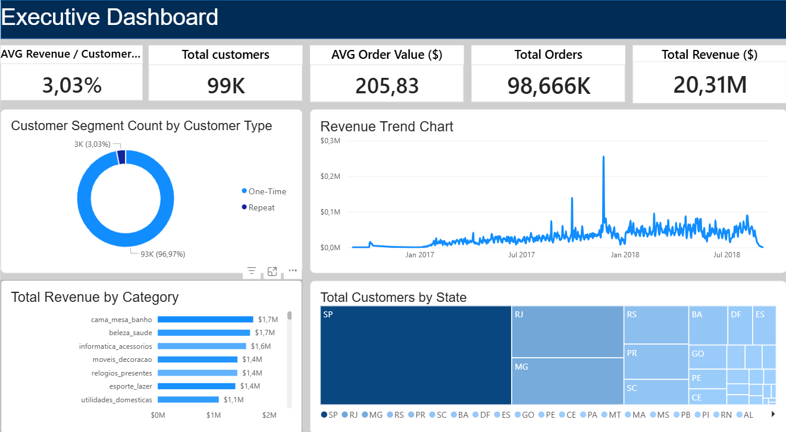

# Customer Revenue Intelligence Platform

## Overview

This project is an end-to-end analytics and business intelligence solution built using SQL and Power BI to analyze customer purchasing behavior, revenue performance, and retention trends within an e-commerce environment.

The goal of the project was not only to build dashboards, but to simulate a modern analytics workflow aligned with analytical engineering principles:
- layered data architecture
- transformation pipelines
- semantic modeling
- KPI standardization
- business-focused analytics

This project was intentionally designed to bridge the gap between traditional business intelligence and analytical engineering.

---

# Business Problem

E-commerce businesses generate large volumes of transactional data, but often struggle to answer strategic customer questions such as:
- What drives revenue growth?
- Which customers generate the most value?
- Are customers returning after their first purchase?
- Which product categories contribute most to sales?
- How should business metrics be standardized across reporting?

The project addresses these challenges by transforming raw transactional data into analytics-ready business models and executive dashboards.

---

# Objectives

The project aimed to:
- Build a scalable analytics workflow using SQL transformations
- Create a layered data model (raw → staging → marts)
- Implement data quality validation checks
- Develop a semantic model using star schema principles
- Build reusable DAX KPI measures
- Design an executive-facing Power BI dashboard
- Simulate analytical engineering practices within a BI project

---

# Tech Stack

| Tool | Purpose |
|---|---|
| DBeaver | SQL development & database management |
| SQLite | Local analytical database |
| Power BI | Data modeling & dashboarding |
| SQL | Data transformation & modeling |
| DAX | KPI and semantic calculations |
| CSV | Data ingestion/export layer |
| GitHub | Portfolio/project hosting |

---

# Dataset

Dataset Used:
https://www.kaggle.com/datasets/olistbr/brazilian-ecommerce

Core datasets included:
- customers
- orders
- order_items
- order_payments
- products
- sellers
- reviews
- geolocation

---

# Data Architecture

The project followed a layered analytics architecture inspired by modern data platform practices.

```text
RAW LAYER
│
├── raw_orders
├── raw_customers
├── raw_products
└── raw_order_payments

STAGING LAYER
│
├── stg_orders
├── stg_customers
├── stg_products
└── stg_order_payments

MART LAYER
│
├── fact_orders
├── dim_customers
├── dim_products
├── customer_metrics
└── customer_retention
```

---

# Data Quality & Validation

Several validation checks were implemented before modeling:
- duplicate key detection
- null value validation
- invalid payment detection
- datatype validation
- grain validation
- join multiplication analysis

An important analytical discovery during the project:
- `customer_id` did not represent persistent customers
- customer retention logic was refactored using `customer_unique_id`

This significantly improved retention accuracy and semantic model quality.

---

# Semantic Modeling

A star schema model was implemented in Power BI:
- `fact_orders` as transactional fact table
- `dim_customers` and `dim_products` as dimensions
- customer metrics and retention layers for business KPIs

Relationships were configured using:
- many-to-one cardinality
- single filter direction

---

# Key KPIs

Implemented DAX measures included:
- Total Revenue
- Total Orders
- True Customers
- Average Order Value (AOV)
- Repeat Customers
- Repeat Customer Rate
- Average Revenue Per Customer

---

# Dashboard Features

The executive dashboard includes:
- KPI cards
- revenue trend analysis
- customer segmentation
- top product category analysis
- geographic customer distribution
- interactive slicers

The dashboard was designed around executive usability and business storytelling principles.

---

# Key Learnings

This project significantly deepened my understanding of:
- semantic modeling
- star schema design
- DAX evaluation context
- business grain alignment
- analytical engineering workflows
- data quality governance
- KPI standardization
- customer retention logic

One of the most valuable lessons from this project was understanding how incorrect business identifiers can distort analytical outputs and how semantic modeling decisions directly impact business trust in data.

---

# Future Improvements

Planned enhancements include:
- cohort analysis
- dbt-style modular SQL transformations
- incremental refresh logic
- Python automation pipelines
- advanced retention analytics
- cloud warehouse migration
- CI/CD deployment simulation

---

# Screenshots

## Executive Dashboard



## Data Model / Star Schema

1[Data Model](docs/11. Star schema.png)

---

# Repository Structure

```text
customer-revenue-intelligence/
│
├── data/
│   ├── raw/
│   └── final/
│
├── sql/
│   ├── staging/
│   ├── marts/
│   └── quality_checks/
│
├── powerbi/
│   └── CustomerRevenueIntelligence.pbix
│
├── docs/
│   └── screenshots/
│
└── README.md
```

---

# Portfolio Positioning

This project reflects my transition from traditional data analytics toward analytical engineering by combining:
- business analysis thinking
- SQL transformation pipelines
- semantic modeling
- BI engineering
- executive reporting

Rather than focusing only on dashboard visuals, the project emphasizes the underlying analytical architecture and business logic required to produce trustworthy insights.
